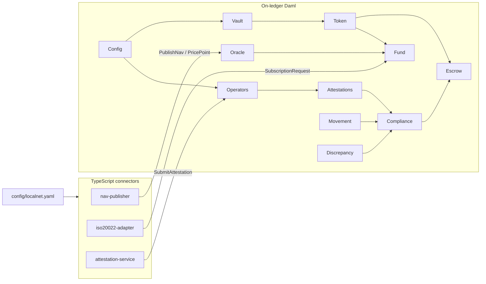

# Gold Custody — Canton Tokenized Gold, Escrow & Fund Settlement

Production-grade prototype of tokenized gold custody, dual-signature attestations, compliance-gated escrow, and fund subscription/redemption on the Canton Network (Daml + CIP-56), with TypeScript off-ledger connectors.

## Prerequisites (verified versions)

| Tool | Version |
|------|---------|
| JDK | 17+ (OpenJDK 17) |
| DPM / Daml SDK | DPM 1.0.21 / SDK **3.5.2** |
| Node.js | 20+ (connectors tested on Node 24) |
| Docker | Required only for LocalNet via cn-quickstart |
| cn-quickstart | Sibling clone at `../cn-quickstart` |

Install DPM:
```bash
curl https://get.digitalasset.com/install/install.sh | sh
export PATH="$HOME/.dpm/bin:$PATH"
```

Install JDK 17 (macOS):
```bash
brew install openjdk@17
export JAVA_HOME="$(brew --prefix openjdk@17)/libexec/openjdk.jdk/Contents/Home"
```

Clone LocalNet sibling (once):
```bash
git clone --depth 1 https://github.com/digital-asset/cn-quickstart ../cn-quickstart
cd ../cn-quickstart/quickstart && make setup && make build
```

## Setup

```bash
cd gold-canton   # this repo
export JAVA_HOME=...  # as above
export PATH="$JAVA_HOME/bin:$HOME/.dpm/bin:$PATH"
dpm build
```

Business parameters and endpoints: [`config/localnet.yaml`](config/localnet.yaml). Design log: [`DECISIONS.md`](DECISIONS.md).

## Run tests

```bash
# All Daml Script tests (positive + negative)
make test
# or: dpm test

# TypeScript connectors (unit + mocked ledger; LocalNet integration skips unless LOCALNET=1)
make test-connectors
# or: cd connector && npm install && npm test
LOCALNET=1 make test-connectors   # enable nav-publisher LocalNet integration test
```

## Demo

```bash
make demo
# or: bash scripts/demo.sh
# Optional: DEMO_LOCALNET=1 make demo
```

Runs E2E scenarios `genesisToRedemption` and `selfFreezingToken`, then prints a settlement timeline.

## Component diagram



## Module map

| Component | Daml module | Tests |
|-----------|-------------|-------|
| C1 Config | `Config.daml` | `Scripts.TestConfig` |
| C2 Vault | `Vault.daml` | `Scripts.TestVault` |
| C3 Operators | `Operators.daml` | `Scripts.TestOperators` |
| C4 Attestations / Compliance | `Attestations.daml`, `Compliance.daml` | `Scripts.TestCompliance` |
| C5 Token (CIP-56) | `Token.daml` | `Scripts.TestToken` |
| C6 Escrow | `Escrow.daml` | `Scripts.TestEscrow` |
| C7 Movement | `Movement.daml` | `Scripts.TestMovement` |
| C8 Discrepancy | `Discrepancy.daml` | `Scripts.TestDiscrepancy` |
| C9 Oracle | `Oracle.daml` | `Scripts.TestOracle` |
| C10 Fund | `Fund.daml` | `Scripts.TestFund` |
| C11 E2E | `Scripts.TestEndToEnd` | five lifecycle scripts |
| C12 Connectors | `connector/*` | Vitest suites |

CIP-56 DARs are vendored under [`dars/`](dars/) (holding, metadata, transfer-instruction v1.0.0).

## ISO 20022 field subset

See [`connector/iso20022-adapter/SCHEMA.md`](connector/iso20022-adapter/SCHEMA.md) for the exact setr.010 / setr.012 fields implemented.

## Verification

See [`VERIFICATION.md`](VERIFICATION.md) for per-component coverage and gate results.
